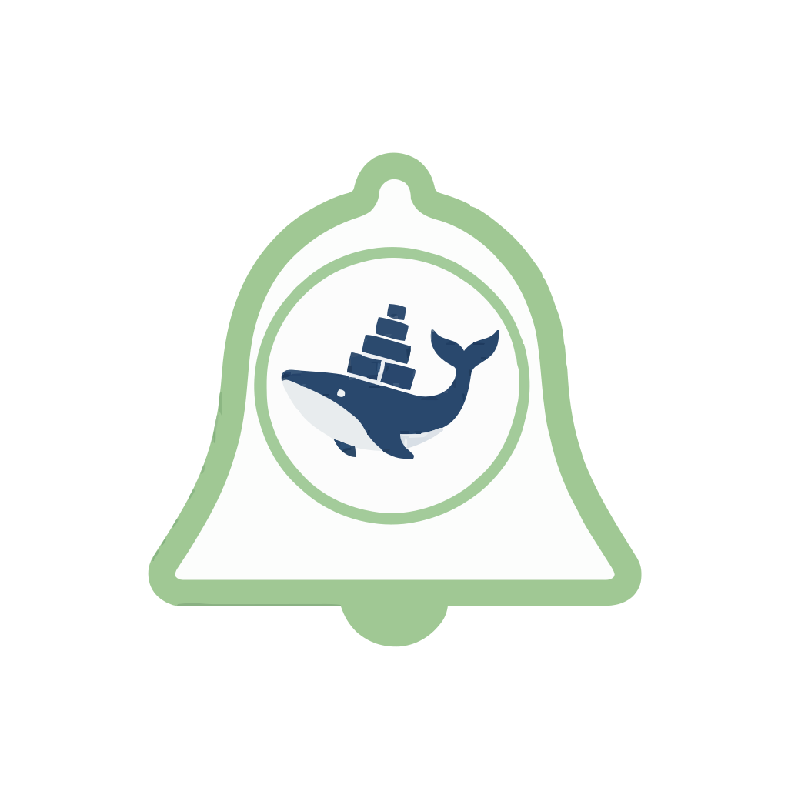
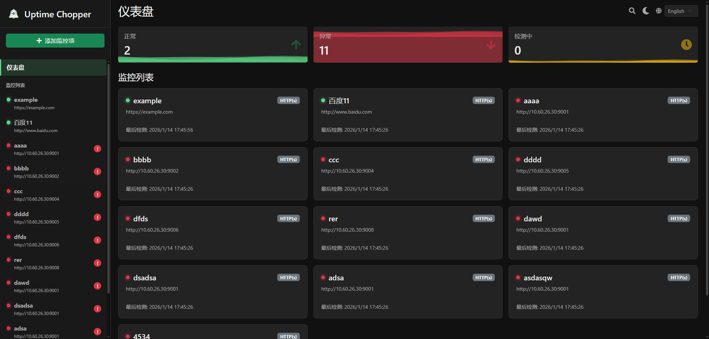

# Uptime Chopper

<div align="center">
  
  <h3>一个轻量级、现代化的自托管监控工具</h3>
  <p>支持 HTTP 服务与 Docker 容器监控，提供实时状态看板与多渠道通知。</p>
</div>

<div align="center">
  
</div>

---

## ✨ 功能特性

- **多类型监控支持**：
  - **HTTP(s)**：监控网站或 API 接口的可用性与响应时间。
  - **Docker 容器**：直接通过 Docker Socket 监控容器运行状态。
- **Docker 深度集成**：
  - 查看实时容器日志。
  - 支持对容器进行启动、停止、重启操作。
  - 支持故障自动重启策略 (Auto-restart)。
- **实时看板**：
  - 现代化 UI 设计，支持 **深色模式 (Dark Mode)**。
  - 动态波浪动效直观展示系统健康度。
  - 响应式布局，适配移动端。
- **多渠道通知**：
  - 支持 **Discord**、**钉钉 (DingTalk)**、**企业微信 (WeChat Work)**。
  - 可为每个监控项单独配置通知策略。
- **国际化支持**：
  - 提供完整的中文与英文界面。

## 🛠️ 技术栈

- **后端**：Go 1.24 (Chi Router, Viper Config)
- **前端**：React 18, Vite, Bootstrap 5, React Icons
- **数据存储**：本地 JSON 文件存储 (无需额外数据库)
- **部署**：Docker / Docker Compose

## 🚀 快速开始

### 方式一：使用 Docker Compose (推荐)

在项目根目录下创建 `docker-compose.yml` 文件：

```yaml
services:
  uptime-chopper:
    # 请根据实际镜像名称修改，或者先构建本地镜像
    image: uptime-chopper:latest
    container_name: uptime-chopper
    restart: always
    ports:
      - "7601:7601"
    volumes:
      - ./data:/app/data
      # 监控 Docker 容器需要挂载 Docker Socket
      - /var/run/docker.sock:/var/run/docker.sock
    environment:
      - TZ=Asia/Shanghai
```

启动服务：

```bash
docker-compose up -d
```

访问 `http://localhost:7601` 即可使用。

### 方式二：手动构建部署

#### 前置要求
- Go 1.24+
- Node.js 18+
- Docker (可选，仅在需要监控容器时)

#### 1. 构建前端

```bash
cd web
npm install
npm run build
# 构建产物将生成在 web/dist 目录
cd ..
```

#### 2. 构建后端

```bash
# 确保在项目根目录
go mod download
go build -o uptime-chopper ./cmd/server
```

#### 3. 运行

```bash
# 运行二进制文件
./uptime-chopper
```

服务默认监听在 `:7601` 端口。

## 📖 开发指南

### 本地开发环境

1. **启动后端服务**：

```bash
go run cmd/server/main.go
```

2. **启动前端开发服务器**：

```bash
cd web
npm run dev
```

前端开发服务器通常运行在 `http://localhost:5173`，并通过代理转发 API 请求到后端。

## ⚙️ 环境变量配置

| 变量名 | 默认值 | 说明 |
| :--- | :--- | :--- |
| `UPTIME_CHOPPER_HTTP_ADDR` | `:7601` | 服务监听地址 |
| `UPTIME_CHOPPER_DATA_DIR` | `./data` | 数据存储目录 |
| `UPTIME_CHOPPER_SERVE_FRONTEND` | `true` | 是否托管静态前端文件 |

## 🔔 通知配置说明

### 钉钉机器人 (DingTalk)
1. 在钉钉群聊中添加“自定义机器人”。
2. 安全设置中勾选“加签”或“自定义关键词”（建议关键词包含 `Monitor`）。
3. 复制 Webhook 地址填入 Uptime Chopper 配置。

### 企业微信 (WeChat Work)
1. 在企业微信群中添加“群机器人”。
2. 复制 Webhook 地址填入配置。

## 📄 许可证

本项目采用 [MIT License](LICENSE) 许可证。
